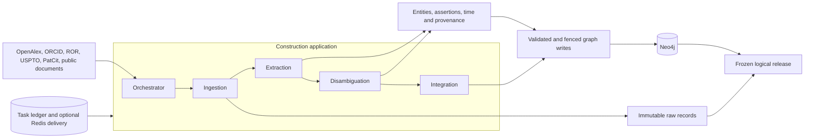
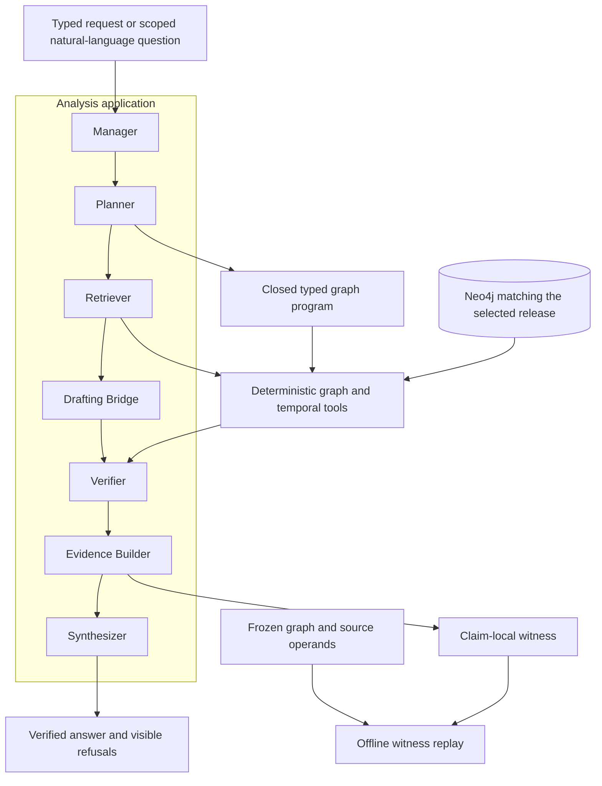
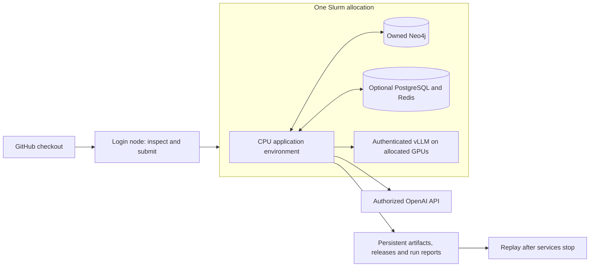

# Knowledge Diffusion

Two Microsoft AutoGen applications build and analyze a temporal scientific graph in Neo4j. Construction preserves source records, identity alternatives and uncertain dates. Analysis produces typed graph programs, checks atomic claims and attaches evidence that can be replayed without a model.

**Local model inference runs on GPUs through vLLM.** OpenAI inference runs through the API and needs no local GPU. The application, source parsers and graph tools run on CPUs. Each live run requires an explicit profile, a request and token budget, and a matching capability check. OpenAI profiles also require a cost limit and dated prices.

The repository provides a bounded implementation and deployment tools. The original graph and 215-item benchmark were not supplied, so the published experiments have not been reproduced. [Validation status and remaining work](docs/STATUS.md) distinguish implemented behavior from untested infrastructure and incomplete paper features.

## What is available

| Component    | Implementation                                                                                                                                             |
| ------------ | ---------------------------------------------------------------------------------------------------------------------------------------------------------- |
| Construction | Five AutoGen role families, local OpenAlex, ORCID, ROR, USPTO and PatCit readers, public web capture and exact-span extraction                             |
| Analysis     | Seven AutoGen roles, ten typed operators, identity resolution, counts, matched comparisons, sites, timelines, event states, bounded paths and return moves |
| Verification | Six labels, conservative Partial rewrites, causal refusal, complete operands, claim-local witnesses and offline replay                                     |
| Durability   | Content-addressed files or PostgreSQL artifacts, task leases, fenced write intents, optional Redis delivery, extraction caches and coordinated workers     |
| Deployment   | CPU fixture pilot, GPU or API job launcher, fresh owned services, generation checks, shutdown checkpoints and logical restore                              |
| Evaluation   | Benchmark import, independent annotation contracts, recorded-run metrics and paired item or dialogue bootstrap                                             |

Extraction caching is off by default. Use `--extraction-cache` on a build or worker command to measure it on your inputs. No cache speedup is assumed.

All source readers are bounded. The current graph export limit is 20,000 records across its collections. Source batches accept at most 1,000 records and 16 MiB of decompressed data. Exceeding a limit fails visibly. This release is suitable for small research pilots, with further work required for national-scale ingestion and the full distributed performance profile.

## Architecture

Construction uses five actual `AssistantAgent` roles. Their tools validate source data and write deterministic graph records. Matching names alone never authorize an identity merge.



The graph contains Authors, Papers, Institutions, Topics, Patents and Grants. Each assertion retains its source version and derivation. Unknown endpoints, dates or source coverage stay explicit.



The exact labels are **Supported, Partial, Unsupported, Contradicted, Ambiguous and NEI**. Partial claims are narrowed or withheld. The renderer cannot add facts beyond verified claims. Temporal association alone never licenses a causal claim. Announcement records are kept separate from operational site records.



Select one inference provider for a run. There is no automatic provider fallback. Co-located services bind to loopback. Shared services across multiple nodes remain unvalidated and are not enabled by these launchers.

## Rivanna setup

### Get the project

Connect through your established UVA SSH or Open OnDemand setup. The commands below use Bash. UVA documents `login.hpc.virginia.edu` as its SSH entry point in the [current access guide](https://rc.virginia.edu/request-manage/ssz-login).

```bash
ssh YOUR_COMPUTING_ID@login.hpc.virginia.edu
```

You can clone directly on Rivanna.

```bash
git clone https://github.com/ur6yr/knowledge-diffusion.git "$HOME/knowledge-diffusion"
export KDIFF_REPO="$HOME/knowledge-diffusion"
cd "$KDIFF_REPO"
git rev-parse HEAD
```

For later updates, inspect local changes and pull the committed project.

```bash
cd "$KDIFF_REPO"
git status --short
git pull --ff-only
```

Keep your existing pipeline environment, `config.sh`, `$OA_ENV`, jobs and databases unchanged. Login nodes are for Git, inspection and submission. Run installation, graph services and inference inside an allocation.

### Interactive Code Server settings

Open [UVA Open OnDemand](https://ood.hpc.virginia.edu/) and select **Interactive Apps → Code Server**. Choose resources for the workflow you intend to run.

| Setting             | Editing, fixtures or OpenAI | Local Llama 3.1 8B pilot                               |
| ------------------- | --------------------------- | ------------------------------------------------------ |
| Allocation          | Your approved account       | Your approved GPU account                              |
| Partition           | Interactive CPU option      | An available GPU partition shown by the site           |
| Hours               | 2                           | 2                                                      |
| CPU cores           | 4                           | 8                                                      |
| Total host memory   | 24 GB                       | 48 GB                                                  |
| GPUs                | 0                           | 1                                                      |
| GPU type            | None                        | A100 with 40 GB or 80 GB, if available to your account |
| Nodes               | 1                           | 1                                                      |
| Extra Slurm options | Blank                       | Only site-required options for your allocation         |

These are suggested resources, not measured Rivanna requirements. The GPU choice is for an existing 8B checkpoint and bounded context. Llama 4 Scout has 109B total parameters and needs separate capacity planning. It is not covered by the one-GPU recommendation.

Form fields and availability can change. Check the allocation summary before launching. Where memory defaults to 6 GB per core, four cores provide 24 GB. See [UVA Code Server guidance](https://learning.rc.virginia.edu/tutorials/vscode-intro/vscode-intro.pdf), [CPU allocation guidance](https://learning.rc.virginia.edu/notes/llms-hpc/inference/cpu-allocation-inference/) and [current compute resources](https://rc.virginia.edu/services/compute-and-storage/aftonrivanna).

Open the project folder and a terminal in Code Server. That terminal is already inside its Slurm allocation. If using SSH instead, request an allocation with your verified account and partition.

```bash
module list
module spider miniforge
squeue -u "$USER"
export KDIFF_ACCOUNT=YOUR_ALLOCATION
export KDIFF_PARTITION=YOUR_CPU_PARTITION

# Skip this allocation command inside Code Server
ijob -A "$KDIFF_ACCOUNT" -p "$KDIFF_PARTITION" \
  --nodes=1 --ntasks=1 --cpus-per-task=4 --mem=24G --time=02:00:00
```

### Create the application environment

Choose a new application environment. Use approved persistent storage for results and scratch for temporary service directories.

```bash
export KDIFF_ENV=/absolute/path/to/new/kdiff-cpu-env
export KDIFF_WORK=/absolute/path/to/your/scratch/kdiff
export KDIFF_ARCHIVE=/absolute/path/to/persistent/kdiff-results
export KDIFF_NEO4J_HOME=/absolute/path/to/verified/neo4j-community-2026.02.2
export KDIFF_JAVA_HOME=/absolute/path/to/verified/linux-jdk-21

module load miniforge
source "$(conda info --base)/etc/profile.d/conda.sh"
conda env list
(
set -euo pipefail
test -n "${SLURM_JOB_ID:-}"
test ! -e "$KDIFF_ENV"
conda create --prefix "$KDIFF_ENV" python=3.13 pip
conda activate "$KDIFF_ENV"
cd "$KDIFF_REPO"
python -m pip install -r requirements-lock.txt
python -m pip install --no-build-isolation --no-deps .
python -m pip check
python -m kdiff doctor
python -m kdiff preflight --path "$KDIFF_WORK" --path "$KDIFF_ARCHIVE"
) && conda activate "$KDIFF_ENV"
```

Inspect Conda's proposed changes before accepting them. If the environment path already exists, inspect it before deliberately reusing it. Reinstall the project after pulling updates.

The application lock was installed and tested on macOS arm64 with Python 3.13.13. Linux installation and the cluster run remain separate validation steps. GPU dependencies belong in another environment or an existing read-only Apptainer SIF.

### Verify the service binaries

Reuse verified Linux Neo4j and Java binaries. The launcher creates its own configuration and database directory. It never uses an existing database store.

For `neo4j-community-2026.02.2-unix.tar.gz`, Neo4j publishes the checksum in a [separate SHA-256 file](https://dist.neo4j.org/neo4j-community-2026.02.2-unix.tar.gz.sha256). The value below was checked against that official file on 23 September 2026. From the directory containing your downloaded tarball, run:

```bash
printf '%s  %s\n' \
  '4e95626e21348a30109799a44639c2169bc24e27e1a1371972ff2583c3d8493c' \
  'neo4j-community-2026.02.2-unix.tar.gz' | sha256sum --check -
```

A match prints `neo4j-community-2026.02.2-unix.tar.gz: OK`. If verification fails, do not unpack the archive. After a successful check, unpack it into a new user-owned directory and set `KDIFF_NEO4J_HOME` to the extracted `neo4j-community-2026.02.2` directory. Keep `KDIFF_JAVA_HOME` pointed at your verified Java 21 installation, including one provided by the Rivanna module system.

Check the resulting paths before running the pilot:

```bash
test -x "$KDIFF_NEO4J_HOME/bin/neo4j"
test -x "$KDIFF_NEO4J_HOME/bin/neo4j-admin"
"$KDIFF_JAVA_HOME/bin/java" -version
mkdir -p "$KDIFF_WORK" "$KDIFF_ARCHIVE"
```

If binaries are unavailable, obtain them through your approved software source. Follow the binary requirements in the [Neo4j Linux tarball documentation](https://neo4j.com/docs/operations-manual/current/installation/linux/tarball/). This project uses no root installation, system service or Docker daemon.

For PostgreSQL and Redis mode, also set paths to existing verified user-space executables. Their local server integration has not been executed in the development environment.

```bash
export KDIFF_METADATA=postgres
export KDIFF_POSTGRES_BIN=/absolute/path/to/verified/postgresql/bin
export KDIFF_REDIS_SERVER=/absolute/path/to/verified/redis-server
```

Leave `KDIFF_METADATA` unset for the single-host development artifact store and SQLite task ledger. The optional metadata launcher creates fresh authenticated services on ports 25432 and 26379. It exports logical artifacts and task state before stopping its own children.

### Run the CPU tests and fixture

Inside Code Server or another allocation, run the CPU pilot directly.

```bash
cd "$KDIFF_REPO"
export KDIFF_PILOT_MODE=tests
bash deploy/rivanna/pilot.sbatch
export KDIFF_PILOT_MODE=demo
bash deploy/rivanna/pilot.sbatch
```

To submit from a login shell, use the batch scheduler instead. Ensure the environment variables are set in that shell.

```bash
export KDIFF_PILOT_MODE=tests
sbatch --account="$KDIFF_ACCOUNT" --partition="$KDIFF_PARTITION" \
  --export=ALL --output="$KDIFF_ARCHIVE/slurm-%j.out" \
  "$KDIFF_REPO/deploy/rivanna/pilot.sbatch"
squeue -u "$USER"
```

The script requests two cores, 4 GB and 20 minutes when submitted with `sbatch`. It reports a persistent result directory with logs, JUnit results and an environment manifest. The fixture uses explicit scripted model responses and synthetic records. It is a software check, not a research result.

### Run with GPUs and vLLM

Use an existing checkpoint, its verified tool-calling chat template and a separate tested vLLM environment. No model weights or serving image are downloaded automatically. The launcher checks supported command options, visible GPUs, runtime versions and authenticated readiness.

```bash
export KDIFF_MODE=local
export KDIFF_MODEL=/absolute/path/to/existing/Llama-3.1-8B-Instruct
export KDIFF_CHAT_TEMPLATE=/absolute/path/to/verified/tool-chat-template.jinja
export KDIFF_TOOL_PARSER=llama3_json
export KDIFF_GPU_ENV=/absolute/path/to/existing/verified/vllm-env
export KDIFF_TP=1
export KDIFF_CONTEXT=16384
export KDIFF_JOB=/absolute/path/to/your/bounded-job.json
export KDIFF_GPU_PARTITION=YOUR_GPU_PARTITION
export KDIFF_GPU_REQUEST=YOUR_SITE_GPU_REQUEST

sbatch --account="$KDIFF_ACCOUNT" --partition="$KDIFF_GPU_PARTITION" \
  --gres="$KDIFF_GPU_REQUEST" --export=ALL \
  --output="$KDIFF_ARCHIVE/slurm-%j.out" \
  "$KDIFF_REPO/deploy/rivanna/run.sbatch"
```

Set `KDIFF_GPU_REQUEST` to the resource syntax confirmed for your allocation. For a read-only image, set `KDIFF_VLLM_SIF` to the verified SIF path instead of setting `KDIFF_GPU_ENV`. The model and template are bound read-only. Keep Apptainer caches in approved user-owned storage.

The launcher creates a restricted provider profile and runs completion, tool-call, structured-output and usage checks before construction. Its one-job request and token budgets cover capability checks, construction and analysis together. Model-specific refusal behavior and actual GPU performance still require validation. See [vLLM tool-calling documentation](https://docs.vllm.ai/en/latest/features/tool_calling/).

### Run with the OpenAI API

Copy the example profile to an ignored runtime directory and edit it. Set the actual authorized model, context limit, `execution_authorized`, a positive total job cost limit, input and output prices per million tokens, and their date. Use an absolute capability-report path. Obtain prices for the selected model from the provider before authorizing the run.

```bash
mkdir -p .runtime
cp configs/openai.example.json .runtime/openai.json
export KDIFF_MODE=openai
export KDIFF_PROFILE="$KDIFF_REPO/.runtime/openai.json"
export KDIFF_JOB=/absolute/path/to/your/bounded-job.json
read -rsp 'OpenAI API key: ' OPENAI_API_KEY
export OPENAI_API_KEY

sbatch --account="$KDIFF_ACCOUNT" --partition="$KDIFF_PARTITION" \
  --cpus-per-task=4 --mem=24G --export=ALL \
  --output="$KDIFF_ARCHIVE/slurm-%j.out" \
  "$KDIFF_REPO/deploy/rivanna/run.sbatch"
```

This submission requests no GPU. The profile is disabled until you explicitly authorize it and configure its budget. Failed calls with unknown usage retain their reservation. Their cost is reported as unknown rather than zero.

### Job input, replay and recovery

A job JSON file identifies one existing source file and one typed analysis request. Copy [the fixture job](configs/job.fixture.json) to start. For real data, set `input` to an absolute path, use a `local:` namespace and supply an identifier present in those records. Supported request families are documented in [the usage guide](docs/USAGE.md).

The live job script saves `result.json`, a complete artifact store, service manifests, logs and a logical checkpoint. The service directories are fresh for each run. It handles pre-walltime signals and stops only its own child processes. There is no automatic requeue. Actual Slurm signal propagation and node-loss recovery remain untested.

Replay a saved answer after services stop by taking its run hash from `result.json`.

```bash
python -m kdiff --store /absolute/path/to/results/store \
  replay --run SAVED_ANALYSIS_RUN_HASH
```

To resume into a new empty graph, set the prior checkpoint's release hash and artifact-store path before resubmitting. PostgreSQL mode also needs its exported state directory.

```bash
export KDIFF_RESTORE_RELEASE=SAVED_RELEASE_HASH
export KDIFF_RESTORE_STORE=/absolute/path/to/prior/results/store
# PostgreSQL mode only
export KDIFF_RESTORE_STATE=/absolute/path/to/prior/results
```

Restore validates source operands and the logical graph hash. It refuses a populated target. It does not copy a live database directory. Keep the entire persistent artifact store and the original release IDs. Scratch must not hold the only evidence copy.

## Commands and development

| Command                                        | Purpose                                                                               |
| ---------------------------------------------- | ------------------------------------------------------------------------------------- |
| `doctor`, `preflight`, `sources`               | Inspect software, allocation and configured source coverage                           |
| `seed`                                         | Import a bounded CSV or selected XLSX discovery cohort                                |
| `build`, `capture-web`, `build-web`            | Capture sources and construct graph evidence                                          |
| `queue-build`, `worker`, `tasks`               | Queue versioned source batches and run bounded coordinated workers                    |
| `snapshot`, `inspect`, `reconcile`, `maintain` | Freeze releases, inspect identities, retain conflicts and perform bounded maintenance |
| `ask`, `chat`                                  | Analyze a selected release and persist dialogue state                                 |
| `replay`                                       | Recompute witnesses without a model, network or running graph                         |
| `provider-check`                               | Run explicitly authorized live capability checks                                      |
| `benchmark-build`, `evaluate`                  | Import supplied benchmarks and score independently annotated stored runs              |

```bash
python3.13 -m venv .venv
.venv/bin/python -m pip install -r requirements-lock.txt
.venv/bin/python -m pip install --no-build-isolation --no-deps .
.venv/bin/python -m pytest -q
```

Database tests skip unless `KDIFF_SERVICE` points to a fresh owned service. Live provider tests skip unless explicitly enabled with authorized test profiles. See [usage and testing](docs/USAGE.md), [source formats](docs/SOURCES.md), [scientific decisions](docs/DECISIONS.md) and [validation status](docs/STATUS.md).

## Project files and publishing

```text
src/kdiff/
  construction/       Source adapters, resolution, seeds and workers
  analysis/           Typed programs, temporal tools, claims and witnesses
  core/               Graph contract, artifacts, caches and durable state
  inference/          Provider clients, capability checks and budgets
  deployment/         Readiness, preflight and owned service launchers
  evaluation/         Benchmark import and independent metrics
  prompts/            Required application role prompts
configs/              Disabled live examples and a synthetic fixture job
deploy/               Local Neo4j and Rivanna Slurm launchers
scripts/              Packaging, bounded jobs and recovery checks
tests/                Unit, real-database and opt-in live checks
docs/                 Usage, source coverage and validation notes
```

Local workspace instructions, planning records, supplied papers, credentials and generated artifacts are excluded by `.gitignore`. Review the staged project files before publishing.

```bash
git add .
git diff --cached --stat
git diff --cached --check
git commit -m "Implement temporal knowledge graph construction and analysis"
git push origin HEAD
```

For transfer without Git, create a project-only archive. Each archive includes file checksums and refuses to overwrite an existing output.

```bash
python3 scripts/package_project.py --list
python3 scripts/package_project.py --output dist/knowledge-diffusion-release.tar.gz
```
