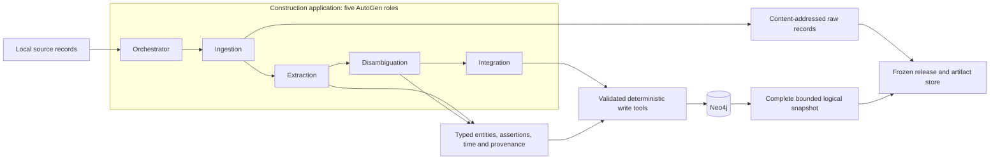
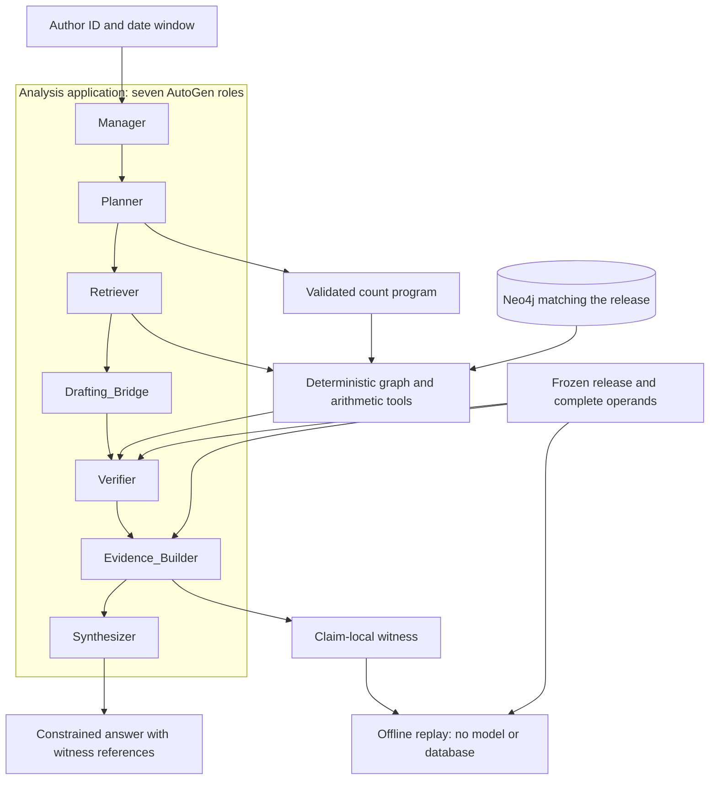
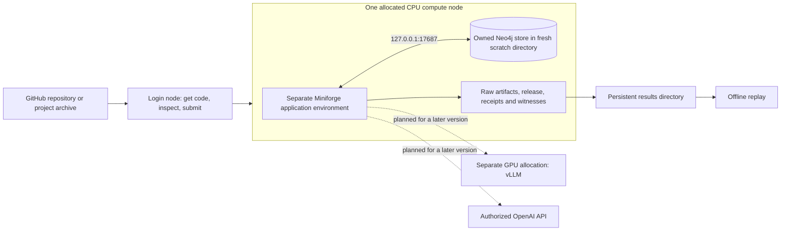

# Knowledge Diffusion

[Architecture](#architecture) · [Rivanna setup](#rivanna-setup) · [Commands](#commands-and-local-development) · [Publishing](#project-layout-and-publishing)

Two Microsoft AutoGen applications share a temporal scientific graph in Neo4j:

- **Construction** captures source records, extracts assertions, preserves identity and date uncertainty, and integrates evidence into the graph.
- **Analysis** executes typed questions against a frozen graph release and attaches replayable evidence to its answers.

The current version, **M1**, runs a small end-to-end workflow with synthetic data. The Rivanna instructions below cover setup, testing and replaying the results. Reproducing the published experiments still requires the original datasets and benchmarks, complete source adapters, and live model integration.

## Implementation and validation status

| Component | Available now | Validation |
|---|---|---|
| Construction | Five real AutoGen `AssistantAgent` roles, bounded local OpenAlex JSONL/JSONL.gz ingestion | Local synthetic fixture with explicitly scripted model responses |
| Analysis | Seven real AutoGen roles, exact-author publication count over a date window | Counts checked against actual Neo4j and saved source operands |
| Evidence | Versioned assertions, raw records, frozen logical releases, claim-local witnesses, offline replay | Missing/tampered operands rejected, old evidence survives graph changes |
| Neo4j | Fresh, owned development store, loopback Bolt, authenticated readiness and cleanup | Community 2026.02.2 / OpenJDK 21.0.10 on macOS arm64 |
| Python environment | Pinned CPU application and test dependencies | Python 3.13.13, AutoGen 0.7.5, Neo4j driver 6.1.0 |
| Rivanna | Project-only deployment archive and bounded single-node Slurm pilot | Packaging and local checks only, **no cluster execution yet** |
| Local vLLM / OpenAI | Shared client factory and example configuration files | **Live execution blocked** pending capability and budget controls |
| Distributed operation | Planned PostgreSQL artifacts, Redis leasing, parallel workers and recovery | Not implemented |

The recorded local integration gate was **26 passed, 2 skipped**. Both skips were live-provider checks. A passing mock fixture demonstrates software mechanics, not research performance. Rivanna results must be recorded separately after running there.

## Architecture

### Construction and the shared graph contract

The five role families execute through AutoGen and select typed tools. Deterministic tools capture, validate, hash, integrate, and calculate. Model text is not itself a graph assertion. M1 exercises the roles in a fixed, bounded workflow using scripted fixture responses.



The schema includes Authors, Papers, Institutions, Topics, Patents and Grants. Current source ingestion covers only a subset. IDs initially represent source identities. A matching name does not establish a person match. Assertions retain source paths, source versions and time precision. Unknown or conflicting dates can cause abstention instead of a fabricated count.

### Analysis and replay



The shared label vocabulary is **Supported, Partial, Unsupported, Contradicted, Ambiguous, NEI**. The general six-way verifier is still pending. The current implementation verifies a narrow count claim or withholds it. Production analysis must narrow a Partial candidate into a supportable claim or withhold it while retaining its history. Temporal association does not establish causation.

M1 uses a single-host application lock. New questions require the working graph to match the selected release. After construction changes, create a new snapshot. Old witnesses replay from their saved release. This is a logical evidence export, not a database backup or distributed snapshot protocol.

### Rivanna pilot deployment



The pilot uses no Docker daemon, root privileges, systemd, GPU or paid model calls. The checked-in launcher requests one node, two CPU cores, 4 GiB RAM and 20 minutes. These are pilot requests, not measured production sizing. There is no validated checkpoint/requeue, multi-node service discovery or database restore yet.

## Rivanna setup

### 1. Connect and inspect the environment

Use your UVA computing ID and your institution-approved SSH/VPN configuration. The documented SSH host is `login.hpc.virginia.edu`. Check current access instructions if your setup differs. [UVA access guide (archived)](https://archive.rc.virginia.edu/userinfo/hpc/login/).

From your workstation:

```bash
ssh YOUR_COMPUTING_ID@login.hpc.virginia.edu
```

You can also use a terminal in Open OnDemand or Code Server. On Rivanna, use a Bash shell for the following commands. Inspect existing jobs, modules, environments and the source and service paths you already use before installing anything:

```bash
module list
module spider miniforge
squeue -u "$USER"
qlist
qlimits
```

Choose a valid allocation account and a CPU partition from your current site configuration. `ijob` provides an interactive allocation. `sbatch` submits the pilot. [UVA Slurm guide (archived)](https://archive.rc.virginia.edu/userinfo/hpc/slurm/).

Keep your existing pipeline, `config.sh`, `$OA_ENV`, jobs and database unchanged. Login nodes are for inspection, file transfer, Git operations and job submission. Install dependencies and run graph or model workloads inside an allocation.

### 2. Get the project from GitHub

After committing and pushing the project from your workstation, clone it directly on Rivanna. Choose a new directory for the checkout:

```bash
git clone https://github.com/ur6yr/knowledge-diffusion.git "$HOME/knowledge-diffusion"
export KDIFF_REPO="$HOME/knowledge-diffusion"
cd "$KDIFF_REPO"
git rev-parse HEAD
```

Keep the commit ID with your run notes so you can identify the code you used. Git transfers committed project files. Ignored local files stay on your workstation.

For later updates, inspect any local changes before pulling:

```bash
cd "$KDIFF_REPO"
git status --short
git pull --ff-only
git rev-parse HEAD
```

Save or commit local edits before updating. If the branches have diverged, `--ff-only` stops instead of creating a merge. After an update, repeat the dependency and package installation commands from step 3 inside your allocation to keep the installed application in sync.

<details>
<summary>Alternative: transfer a project archive</summary>

To transfer code before pushing it, create an archive on your workstation with Python 3.11–3.13:

```bash
python3 scripts/package_project.py --list
python3 scripts/package_project.py --output dist/knowledge-diffusion.tar.gz
tar -tzf dist/knowledge-diffusion.tar.gz
scp dist/knowledge-diffusion.tar.gz YOUR_COMPUTING_ID@login.hpc.virginia.edu:~/
```

The packager includes the application, tests, configuration examples, documentation and required agent prompts. Local workspace files, environments, secrets and generated data are excluded. It refuses to overwrite an existing archive, so use a new filename for each revision. `BUILD_MANIFEST.json` records the size and SHA-256 of every included file.

On Rivanna, extract into a new directory:

```bash
mkdir "$HOME/knowledge-diffusion-release-01" && \
  tar -xzf "$HOME/knowledge-diffusion.tar.gz" -C "$HOME/knowledge-diffusion-release-01"
export KDIFF_REPO="$HOME/knowledge-diffusion-release-01/knowledge-diffusion"
cd "$KDIFF_REPO"
```

An extracted archive has no Git history. To update it, unpack a new archive into a new directory or use the GitHub workflow above.

</details>

### Interactive development with Code Server

Open [UVA Open OnDemand](https://ood.hpc.virginia.edu/) and choose **Interactive Apps → Code Server**. For editing, installing dependencies and running the current fixture, start with these settings:

| Setting | Value |
|---|---|
| Rivanna/Afton Partition | **Interactive** |
| Allocation | Your approved allocation account |
| Number of hours | **2** |
| Number of cores | **4** |
| Memory Request in GB | **24 GB total** |
| Number of GPUs | **0** |
| GPU type | Leave blank or choose **None** if shown |
| Number of nodes | **1**, if the form exposes this field |
| Optional Slurm options | Leave blank |

These are suggested starting resources for the editor, Python application and small Neo4j fixture. They have not been benchmarked on Rivanna. The current workflow does not use a GPU. Live vLLM serving remains unavailable in this version and will need a separate GPU allocation sized for the chosen model.

The form fields are described in [UVA's Code Server guide](https://learning.rc.virginia.edu/tutorials/vscode-intro/vscode-intro.pdf). Field visibility can vary with the partition. If memory is assigned automatically at 6 GB per core, four cores provide 24 GB. Check the session's resource summary before launching. [UVA CPU allocation guidance](https://learning.rc.virginia.edu/notes/llms-hpc/inference/cpu-allocation-inference/).

Click **Launch**, wait for the session to start, then connect to Code Server. Open the project folder at `KDIFF_REPO` and a terminal using **Terminal → New Terminal**. That terminal is already inside your allocation. Set the paths in step 3 and run its environment setup commands, skipping the `ijob` command. Continue with the binary checks in step 4.

To run the tests and demo in the same Code Server allocation, use the following after setup:

```bash
cd "$KDIFF_REPO"
export KDIFF_PILOT_MODE=tests
bash deploy/rivanna/pilot.sbatch
# After the tests succeed:
export KDIFF_PILOT_MODE=demo
bash deploy/rivanna/pilot.sbatch
```

When invoked with `bash` inside this allocation, the script uses the session's resources. Its `#SBATCH` lines apply only when submitted with `sbatch`. Each run prints its result directory. You can skip the separate batch submissions in step 5 and proceed to replay in step 6. Save your work before the session expires, and end the session through Open OnDemand when finished.

### 3. Set paths and create a separate CPU environment

Replace every `YOUR_...` or `/absolute/...` value below. Paths must be absolute and visible on the selected compute nodes. Use a new environment path. Keep results in approved persistent storage. Scratch is working space, and a results copy is not an independently managed backup. [UVA storage guide (archived)](https://archive.rc.virginia.edu/userinfo/storage/).

```bash
export KDIFF_ACCOUNT=YOUR_ALLOCATION
export KDIFF_PARTITION=YOUR_CPU_PARTITION
export KDIFF_ENV=/absolute/path/to/new/kdiff-cpu-env
export KDIFF_WORK=/absolute/path/to/your/scratch/kdiff
export KDIFF_ARCHIVE=/absolute/path/to/persistent/kdiff-results
export KDIFF_NEO4J_HOME=/absolute/path/to/verified/neo4j-community-2026.02.2
export KDIFF_JAVA_HOME=/absolute/path/to/verified/linux-jdk-21

# SSH workflow only. Skip this command inside Code Server.
ijob -A "$KDIFF_ACCOUNT" -p "$KDIFF_PARTITION" \
  --nodes=1 --ntasks=1 --cpus-per-task=2 --mem=4G --time=01:00:00
```

In the allocated terminal, verify the allocation and create the application environment:

```bash
(
set -euo pipefail
test -n "${SLURM_JOB_ID:-}"
module load miniforge
source "$(conda info --base)/etc/profile.d/conda.sh"
conda env list
test ! -e "$KDIFF_ENV"
conda create --prefix "$KDIFF_ENV" python=3.13 pip
conda activate "$KDIFF_ENV"
cd "$KDIFF_REPO"
python -m pip install -r requirements-lock.txt
python -m pip install --no-build-isolation --no-deps .
python -m pip check
python -m kdiff doctor
python -m kdiff sources
)
```

Inspect Conda's proposed download before accepting it. If `KDIFF_ENV` exists, stop and select a new path or inspect that environment before deliberately reusing it. Do not install into an existing pipeline environment. The Miniforge module version is selected from the cluster's installed modules. Record `module list` with your run. [UVA Miniforge guide (archived)](https://archive.rc.virginia.edu/userinfo/hpc/software/miniforge/).

The lock was installed and tested on **macOS arm64 / Python 3.13.13**, not Rivanna Linux. Creating Python 3.13 does not guarantee the same patch version. If pinned packages cannot be installed on your selected Linux architecture, record the failing package and resolve compatibility in a separate environment. Do not silently upgrade the shared lock or report the cluster gate as passed. GPU serving dependencies belong in another environment.

### 4. Verify Neo4j and Java binaries

Reuse a verified Linux-compatible Neo4j Community 2026.02.2 binary distribution and Java 21 installation where available. **Use only their binaries. Never point the pilot at an existing database store.** A macOS Java installation cannot be copied to Linux.

If these binaries are unavailable, obtain the selected Community release and Linux JDK for your compute-node architecture through your approved software source, record their checksums, and unpack into new user-owned tool directories. For a verified local Neo4j tarball, the unpacking step is:

```bash
# Set these only after identifying and verifying the actual archive and directory.
export KDIFF_NEO4J_TARBALL=/absolute/path/to/verified/neo4j-community-2026.02.2-unix.tar.gz
export KDIFF_TOOLS=/absolute/path/to/new/kdiff-tools
sha256sum "$KDIFF_NEO4J_TARBALL"
mkdir "$KDIFF_TOOLS"
tar -xzf "$KDIFF_NEO4J_TARBALL" -C "$KDIFF_TOOLS"
export KDIFF_NEO4J_HOME="$KDIFF_TOOLS/neo4j-community-2026.02.2"
```

For a verified Linux JDK tarball, run `sha256sum` and compare its trusted checksum, extract it into the same new tools directory, and set `KDIFF_JAVA_HOME` to its actual extracted directory (the directory containing `bin/java`). The JDK archive and directory names depend on its distributor and architecture. No installed Java module name is assumed here.

Compare the printed hash with a trusted release checksum. Computing a hash alone does not establish authenticity. No binary downloads are bundled or triggered by this repository. Follow the binary prerequisites in the [Neo4j Linux tarball documentation](https://neo4j.com/docs/operations-manual/current/installation/linux/tarball/). This project supplies its own user-space configuration and does not use the documentation's root/service installation steps.

Inside the allocation, verify the configured binaries:

```bash
test -x "$KDIFF_NEO4J_HOME/bin/neo4j"
test -x "$KDIFF_NEO4J_HOME/bin/neo4j-admin"
"$KDIFF_JAVA_HOME/bin/java" -version
```

The pilot creates its own configuration, authentication secret, data and logs in a fresh directory. It binds Bolt to loopback port 17687, disables HTTP, and refuses occupied ports and existing development directories. To use another unused non-default port, export `KDIFF_BOLT_PORT` before submission. Do not stop another service to free a port. No browser endpoint or SSH tunnel is needed for this co-located pilot.

### 5. Submit the tests, then the demonstration

For the SSH and batch workflow, leave the interactive allocation with `exit` after setup. Code Server users can run the pilot directly as described above. On the login shell, ensure the `KDIFF_*` variables still refer to your chosen paths. Changes made inside the interactive shell do not propagate back. Create the output directory before calling `sbatch`:

```bash
mkdir -p "$KDIFF_ARCHIVE"
export KDIFF_PILOT_MODE=tests
sbatch --account="$KDIFF_ACCOUNT" --partition="$KDIFF_PARTITION" \
  --export=ALL --output="$KDIFF_ARCHIVE/slurm-%j.out" \
  "$KDIFF_REPO/deploy/rivanna/pilot.sbatch"
squeue -u "$USER"
```

Read the returned job ID and its Slurm log. Each job reports a unique scratch work directory and persistent results directory. Inspect `exit-code.txt`, `run.log`, `artifacts/tests.xml`, `environment.json`, `java-version.txt`, `BUILD_MANIFEST.json`, and the Neo4j console log. Compare actual pass/skip counts with the local baseline. Live-provider checks remain explicit skips. An installation failure, timeout or database failure is not a pass.

After the test job succeeds, submit the synthetic demonstration:

```bash
export KDIFF_PILOT_MODE=demo
sbatch --account="$KDIFF_ACCOUNT" --partition="$KDIFF_PARTITION" \
  --export=ALL --output="$KDIFF_ARCHIVE/slurm-%j.out" \
  "$KDIFF_REPO/deploy/rivanna/pilot.sbatch"
```

The job packages only allowlisted files into a unique working directory, starts a fresh owned Neo4j process, runs a bounded command, and stops its own child on normal completion or a handled command failure. It then copies logical artifacts and selected logs to `KDIFF_ARCHIVE`. It does not copy the live database or generated password. Scratch files remain available for inspection under the printed path.

The demo imports the fixture twice, checks idempotency, freezes a release, asks an exact-author count question and replays its witness. Expected fixture result: **2 distinct papers in 2016–2020**, explicitly marked synthetic with mock inference. This number is a software fixture, not an empirical result.

There is no automatic requeue. Forced termination, node failure, archival failure and wall-time recovery remain unvalidated. If a job is interrupted, inspect its Slurm state and specific work directory before another run. The next pilot creates a separate directory. Existing stores are never reopened by this launcher.

### 6. Replay the saved result after the service stops

Set `KDIFF_RESULT_DIR` to the demo's persistent results directory printed in its Slurm log. Keep the **entire** `artifacts/m1/store/` tree, not just `result.json`:

```bash
export KDIFF_RESULT_DIR=/absolute/path/from/the/demo/log
export KDIFF_RUN_HASH=$(
  "$KDIFF_ENV/bin/python" -c \
    'import json, sys
print(json.load(open(sys.argv[1]))["answer"]["run"])' \
    "$KDIFF_RESULT_DIR/artifacts/m1/result.json"
)
"$KDIFF_ENV/bin/python" -m kdiff \
  --store "$KDIFF_RESULT_DIR/artifacts/m1/store" replay --run "$KDIFF_RUN_HASH"
```

Replay uses saved evidence and needs no Neo4j connection, model endpoint or API key. It fails visibly for missing or changed operands. Keep the original witness/release identifiers with shared bundles. Hashes detect changes but are not trusted-party signatures.

Some UVA links above point to archived reference pages. Confirm current access, storage, partition and module details using [UVA Research Computing](https://rc.virginia.edu/) and your cluster's read-only commands before running the recipe.

## Inference profiles

| Profile | Configuration | Current behavior |
|---|---|---|
| Fixture | `configs/mock.json` | Requires `--allow-mock` and a fixture namespace, scripted `ReplayChatCompletionClient` responses |
| Local vLLM | `configs/local-dev.example.json` | Placeholder checkpoint/capabilities, live execution blocked |
| OpenAI | `configs/openai.example.json` | Placeholder authorized model, live execution blocked |

Providing a key or endpoint does **not** enable live runs in this version. The remaining work is capability verification, enforcement of request/token/cost limits, and actual execution tests. There is no automatic paid-provider fallback. Future OpenAI credentials use `OPENAI_API_KEY`. Local endpoint authentication uses `VLLM_API_KEY`. Keep secrets outside Git and deployment archives. OpenAI application jobs need no GPU. A future vLLM server needs a separate, verified GPU environment and allocation. No tested serving image or universal GPU/model configuration is supplied yet.

## Commands and local development

| Command | Purpose |
|---|---|
| `kdiff doctor` | Show installed versions and explicit live-execution status |
| `kdiff sources` | Show implemented and pending connectors |
| `kdiff build` | Bounded local OpenAlex capture and graph construction |
| `kdiff snapshot` | Freeze the namespace and its evidence under the application lock |
| `kdiff ask` | Exact-author publication count against a specified release |
| `kdiff replay` | Recompute a saved claim without a running graph or model |
| `seed`, `reconcile`, `maintain`, `chat`, `evaluate`, `benchmark-build` | Pending commands, exit with status 2 |

Use `python -m kdiff COMMAND --help` for arguments and [the M1 usage guide](docs/M1_USAGE.md) for independent construction/analysis commands and a local Neo4j walkthrough. The current input cap is 1,000 records / 16 MiB decompressed. An exceeded cap fails instead of returning a truncated success.

For a local CPU environment:

```bash
python3.13 -m venv .venv
.venv/bin/python -m pip install -r requirements-lock.txt
.venv/bin/python -m pip install --no-build-isolation --no-deps .
.venv/bin/python -m pip check
.venv/bin/python -m kdiff doctor
.venv/bin/python -m pytest -q
```

Without an owned `KDIFF_SERVICE` manifest, database tests skip explicitly. Use the isolated launcher described in the usage guide to run those checks against real Neo4j. The server launcher imposes a 600-second command timeout. It is for small pilots, not national ingestion.

## Project layout and publishing

```text
src/kdiff/             CLI, workflows, AutoGen roles and application prompts
  core/                Graph, schema, contracts and artifact storage
  construction/        Bounded source capture and parsing
  analysis/            Typed count programs and witness replay
  inference/           Explicit model-client profiles
configs/               Mock profile and live-provider examples
deploy/local/          Isolated development Neo4j launcher
deploy/rivanna/        Bounded CPU Slurm pilot
scripts/               Project-only packaging and end-to-end demonstration
tests/                 Unit/integration checks and labeled synthetic fixture
docs/                  Usage, source coverage and scientific decisions
requirements-lock.txt  Versions installed and tested locally
```

[Source coverage](docs/SOURCES.md) records adapter limitations. [Scientific decisions](docs/DECISIONS.md) explain reconstruction choices. Planned extensions include complete source adapters, general analysis operators, distributed reliability, live inference and original-benchmark evaluation. None are implied by a successful fixture run.

`.gitignore` excludes local workspace instructions, planning records, supplied papers, secrets and generated files. The application, tests, configuration examples, deployment scripts and project documentation remain available to commit. Review the file list before publishing, since ignore rules do not remove files that Git already tracks:

```bash
git status --short
git ls-files
git ls-files --others --exclude-standard
```

The deployment archive uses its own file list, so it excludes local workspace files even when you package uncommitted changes.
